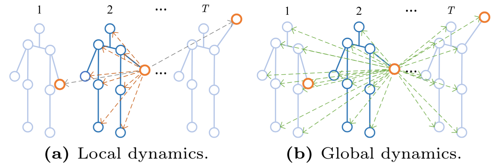

# HybridFormer
###### Zeyun Zhong*, Tianrui Li*, Manuel Martin, Mickael Cormier, Chengzhi Wu, Frederik Diederichs, and Juergen Beyerer
This repository contains the official source code for 
our HybridFormer paper. 
If you find our code or paper useful, please consider citing:
````BibTeX
@InProceedings{Zhong_2024_HybridFormer,
    author    = {Zhong, Zeyun and Li, Tianrui and Martin, Manuel and Cormier, Mickael and Wu, Chengzhi and Diederichs, Frederik and Beyerer, Juergen},
    title     = {HybridFormer: Bridging Local and Global Spatio-Temporal Dynamics for Efficient Skeleton-Based Action Recognition},
    booktitle = {ECCV Workshops},
    year      = {2024}
}
````

<div style="text-align:center">

</div>

## Installation
First clone the repo and set up the required packages in a conda environment.

```bash
git clone https://github.com/zeyun-zhong/HybridFormer.git
# Create and activate conda environment
conda create -n hybridformer python=3.9
conda activate hybridformer
# Install necessary packages
pip install -r requirements.txt
pip install -e torchlight
```


## Prepare Data

### NTU RGB+D 60 and 120
#### Download
1. Request dataset here: https://rose1.ntu.edu.sg/dataset/actionRecognition
2. Download the skeleton-only datasets:
   1. `nturgbd_skeletons_s001_to_s017.zip` (NTU RGB+D 60)
   2. `nturgbd_skeletons_s018_to_s032.zip` (NTU RGB+D 120)
   3. Extract above files to `./data/nturgbd_raw`

#### Preprocessing
Generate NTU RGB+D 60 or NTU RGB+D 120 dataset:

```
 cd ./data/ntu # or cd ./data/ntu120
 # Get skeleton of each performer
 python get_raw_skes_data.py
 # Remove the bad skeleton 
 python get_raw_denoised_data.py
 # Transform the skeleton to the center of the first frame
 python seq_transformation.py
```

### NW-UCLA
#### Download
1. Download dataset from [CTR-GCN](https://github.com/Uason-Chen/CTR-GCN)
2. Move `all_sqe` to `./data/NW-UCLA`

#### Data Processing

Put downloaded data into the following directory structure:

```
- data/
  - NW-UCLA/
    - all_sqe
      ... # raw data of NW-UCLA
  - ntu/
  - ntu120/
  - nturgbd_raw/
    - nturgb+d_skeletons/     # from `nturgbd_skeletons_s001_to_s017.zip`
      ...
    - nturgb+d_skeletons120/  # from `nturgbd_skeletons_s018_to_s032.zip`
      ...
```


## Train, Test, and Ensemble

### Training

```
bash scripts/train_ntu120.sh
```

Please check the configuration in the config directory.

### Testing

```
bash scripts/test_ntu120.sh
```

### Ensemble
To ensemble the results of different models, first save the logits of each model with the testing script, and then run ```ensemble_mp.py```.

## Acknowledgements

This repo is based on [2s-AGCN](https://github.com/lshiwjx/2s-AGCN), [CTR-GCN](https://github.com/Uason-Chen/CTR-GCN) and [Hyperformer](https://github.com/ZhouYuxuanYX/Hyperformer). The data processing is borrowed from [SGN](https://github.com/microsoft/SGN) and [HCN](https://github.com/huguyuehuhu/HCN-pytorch), and the training strategy is based on [InfoGCN](https://github.com/stnoah1/infogcn).
Thanks to the original authors for their work!


